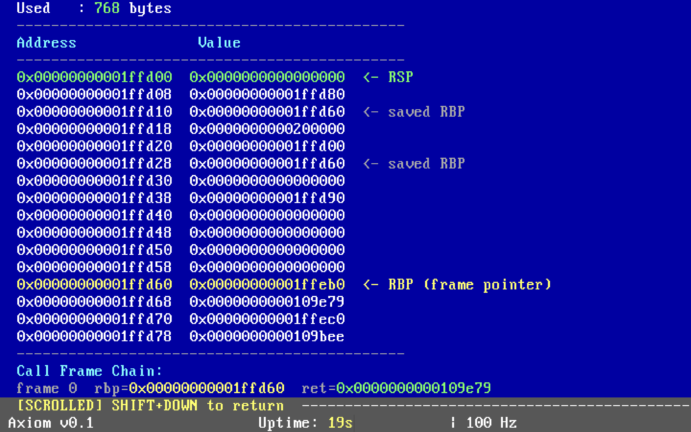
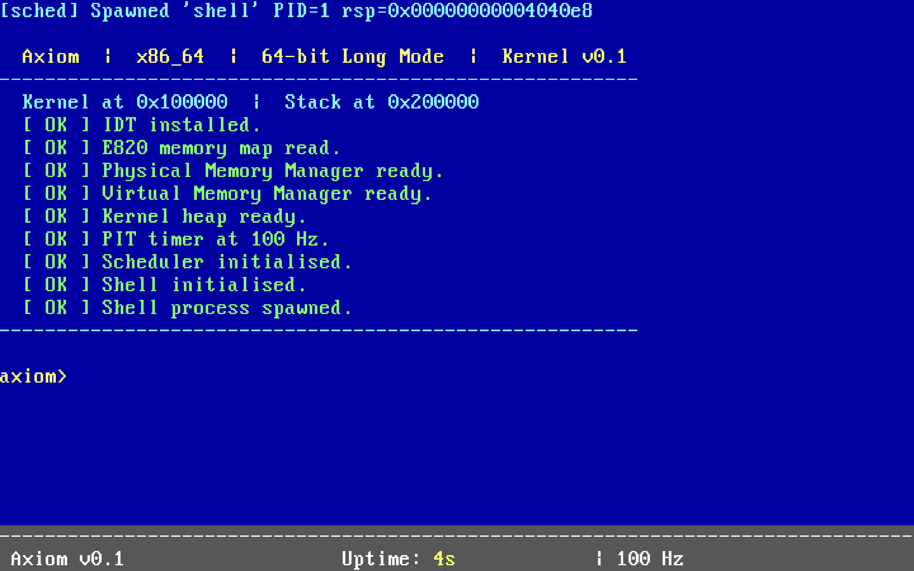

# Axiom
> A minimal x86_64 kernel written from scratch — bare metal, no shortcuts.

Axiom is a hobby operating system built to understand what actually happens between pressing the power button and running a program. No UEFI hand-holding, no GRUB abstraction — just assembly, C, and a lot of determination.

---

## Architecture

Axiom boots through a custom 4-stage bootloader entirely written in x86 assembly before handing off to a 64-bit C kernel.

```
Stage 0  →  Stage 1  →  Stage 2  →  Stage 3  →  Kernel
 BIOS        Real         Protected    Long        64-bit C
 MBR         Mode         Mode         Mode        Entry
```

---

## Features

| Subsystem | Description |
|---|---|
| **Bootloader** | Custom 4-stage bootloader; transitions from real → protected → long mode |
| **VGA Driver** | Text-mode VGA output (80×25), full 16-color palette |
| **Serial Port** | UART serial output for debugging |
| **Memory Map** | E820 BIOS memory map parsing |
| **PMM** | Physical Memory Manager using a bitmap allocator |
| **VMM** | Virtual Memory Manager with paging (PML4, 2MB huge pages) |
| **Heap** | Dynamic kernel heap allocator |
| **IDT / ISR** | Interrupt Descriptor Table + Interrupt Service Routines |
| **PIT** | Programmable Interval Timer @ 100 Hz |
| **Scheduler** | Round-robin task scheduler with context switching |
| **Shell** | Interactive kernel shell with 24 built-in commands |

---

## Shell Commands

Axiom drops into an interactive shell on boot. Available commands:

| Command | Description |
|---|---|
| `help` | List all commands |
| `clear` | Clear the screen |
| `uptime` | Show uptime and tick count |
| `mem` | Memory stats and usage bar |
| `ps` | List processes and states |
| `lsmem` | E820 memory map table |
| `memtest` | Alloc / write / verify / free pages |
| `stress` | Spawn scheduler stress workers |
| `calc <a> <op> <b>` | Simple arithmetic calculator |
| `vmmap` | Virtual memory layout |
| `cpuinfo` | CPU info via CPUID |
| `hexdump <addr> [lines]` | Hex dump memory at address |
| `color` | Display VGA 16-color palette |
| `history` | Command history buffer |
| `version` | Kernel version and build info |
| `echo` | Print arguments |
| `reboot` | Reboot the system |
| `halt` | Halt the CPU |
| `virt2phys <addr>` | Translate virtual → physical address (with page walk) |
| `switchlog` | Log and display context switches |
| `regs` | Display CPU register state |
| `stack` | Dump current stack + call frame chain |
| `trace on\|off` | Live kernel event tracing |
| `schedviz` | Visual scheduler state + timing |

> TAB = autocomplete, UP/DOWN = history navigation

---

## Sample Output

```
===========================================
  Axiom  |  x86_64 Kernel
===========================================
[kernel] IDT loaded
[e820] Total usable: 0x0000000007f7fc00 bytes
[pmm] Initialised: 32736 total pages, 31967 free pages
[vmm] PML4 at 0x4000, 128MB identity-mapped
[heap] Initialised at 0x400000, 16384 bytes
[pit] Initialised at 100 Hz (divisor=11931)
[sched] Initialised. Idle PID=0, quantum=10 ticks
[shell] Initialised with 24 commands
[kernel] Running.
-------------------------------------------

axiom> mem
  Physical Memory:
    Total : 127 MB  (32736 pages)
    Used  : 3 MB  (778 pages)
    Free  : 124 MB  (31958 pages)
  Usage [........................................] 2%

axiom> memtest
  Memtest: 8 pages
  Alloc  : PASS
  Pattern 0xaaaaaaaaaaaaaaaa: PASS
  Pattern 0xdeadbeefcafebabe: PASS
  ALL PASSED

axiom> stress
  Stress: 3 workers (50k iters each)...
  Results:
    worker0 : 50000 iters
    worker1 : 50000 iters
    worker2 : 50000 iters
    total   : 150000
  Round-robin confirmed
```
<br>

---

## Project Structure

```
axiom/
├── boot/
│   ├── stage0/     # MBR bootloader (real mode)
│   ├── stage1/     # Protected mode entry
│   ├── stage2/     # Protected mode setup
│   └── stage3/     # Long mode transition
├── kernel/
│   ├── kernel.c    # Kernel main entry
│   ├── vga.c/h     # VGA text driver
│   ├── serial.c/h  # Serial (UART) driver
│   ├── E820.c/h    # BIOS memory map
│   ├── pmm.c/h     # Physical memory manager
│   ├── vmm.c/h     # Virtual memory manager
│   ├── heap.c/h    # Kernel heap
│   ├── idt.c/h     # Interrupt descriptor table
│   ├── idt.asm     # IDT assembly stubs
│   ├── isr.c       # Interrupt service routines
│   ├── pit.c/h     # PIT timer
│   ├── sched.c/h   # Scheduler
│   ├── sched.asm   # Scheduler context switch (asm)
│   ├── shell.c/h   # Kernel shell
│   ├── types.h     # Base type definitions
│   └── linker.ld   # Kernel linker script
└── Makefile
```

---

## Building

### Requirements

- `nasm` — assembler
- `gcc` (cross-compiler targeting `x86_64-elf`) — C compiler
- `ld` — GNU linker
- `qemu-system-x86_64` — for emulation
- `make`

### Build & Run

```bash
# Build everything
make

# Run in QEMU
make run

# Clean build artifacts
make clean
```

---

## Status

Axiom is a **work in progress**. The core kernel is functional — it boots, manages memory, handles interrupts, schedules tasks, and drops into a shell. There's a lot more to build.

**Planned / In Progress:**
- [ ] Filesystem (FAT32 or custom)
- [ ] Keyboard driver (PS/2)
- [ ] Userspace & syscall interface
- [ ] ELF loader
- [ ] Basic process isolation

---

## Why?

Because "how does an OS work?" is one of those questions that deserves a real answer — not a textbook chapter, but actual code running on actual hardware. Axiom is that answer, built one subsystem at a time.

---

## License

[GNU General Public License v2.0](LICENSE)